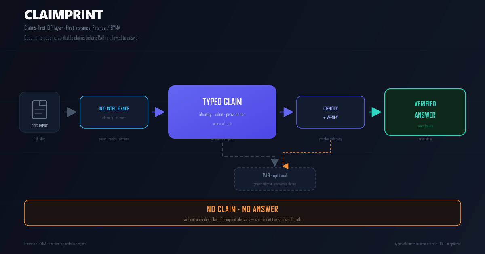
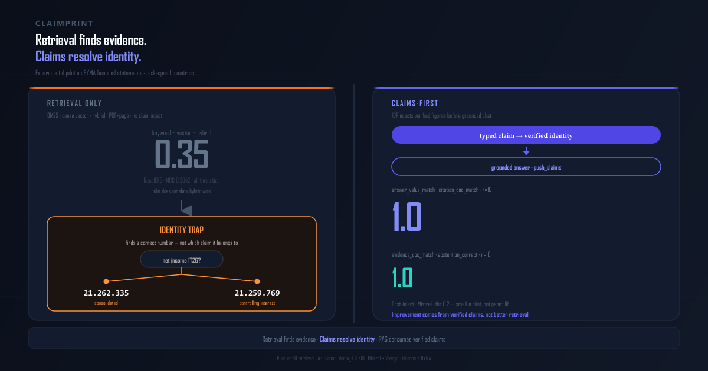

# Claimprint

[Español](README.es.md) · **English** ([README.md](README.md))

En el filing BYMA del 1T26, la pregunta

¿Cuál es el resultado neto del 1T26?


tiene dos vecinos válidos en la misma página

- resultado neto consolidado, *21262335*
- resultado neto atribuible a la controlante, *21259769*
Un RAG genérico suele elegir el vecino equivocado aunque el retrieval haya sido correcto
Claimprint se coloca delante de tu stack RAG y convierte cada cifra en un claim financiero tipado, con identidad y provenance explícitos. Después o bien devuelve una respuesta verificada atada al claim correcto, o se abstiene
Sin claim verificado, sin respuesta
Podés reproducir el ejemplo BYMA con scripts/idp_ask.py, que devuelve la fila de resultado neto consolidado sin Docker ni API keys. Ver Inicio rápido para el detalle

## Para quién es

- *Analistas de research*  
  Necesitan cifras con identidad explícita emisor/período/scope, y un “no hay respuesta” claro cuando el claim no se puede verificar
- *Ingenieros RAG*  
  Quieren una capa pre‑RAG que separe inteligencia documental y verificación de claims del retrieval y la generación, para depurar cada parte de forma independiente

- *Auditores / controllers*  
  Prefieren abstenerse a devolver en silencio una cifra potencialmente equivocada cuando no hay claim verificado

- *Compliance / riesgo*  
  Requieren provenance documento, página, fila en cada respuesta sobre documentos regulados

## ¿Por qué no usar X?

- **¿Mejor RAG / búsqueda híbrida?** La trampa de identidad es estructural — misma página, dos filas vecinas. En el piloto BYMA, keyword, vector e híbrido **empatan** en Recall@5 **0.35** / MRR **0.2042** (n=20).
- **¿GPT-4 + prompt engineering?** Afinar prompts no garantiza abstención estructural. Claimprint abstiene cuando no hay claim verificado.
- **¿Extractores batch (Unstract, Nanonets, …)?** Suelen estar orientados a extracción de campos, no a identidad de scope — distinguir *consolidado* de *controlante* en la misma página es otro problema de diseño; este repo no los benchmarkea.
- **¿Embeddings fine-tuned?** Filas P&L vecinas comparten contexto semántico; los embeddings no codifican scope contable.

Metodología y scores congelados: [`docs/evaluation.es.md`](docs/evaluation.es.md).

## Cómo funciona Claimprint

Claimprint se coloca delante de tu stack RAG. Un documento entra a procesamiento de documentos (parse con MinerU, classify, extract) y se convierte en un **claim financiero tipado**: cifra estructurada con **identidad** (`emisor · período · scope · métrica`), **valor** y **provenance** (documento, página, fila). La clave compuesta se resuelve y verifica antes de emitir cualquier respuesta. El camino principal es **lookup exacto** → respuesta verificada. El chat RAG es una capa **opcional** que consume claims verificados; no es la fuente de verdad. Si ningún claim pasa verificación, Claimprint se abstiene.

**Sin claim verificado, sin respuesta.**

*Términos técnicos en inglés a propósito (como en el código): claim, recipe, scope, provenance, filing.*



```text
PDF → MinerU → Recipe → Claim → [optional RAG chunk] → Chat
                      ↑ source of truth
```

| Artefacto | Rol |
|-----------|-----|
| PDF | evidencia primaria |
| Fixture MinerU | representación parseada |
| Recipe | contrato de extracción |
| Eval gold | expectativa de test |
| Claim | fuente de verdad operativa |
| Chunk RAG | entrada derivada para chat |
| Chat | consumidor |

**Conceptos clave:** un **claim financiero tipado** es la cifra verificada (identidad compuesta + valor + provenance). Una **recipe** es el contrato de extracción para una clase de documento (ej. [`recipes/financial_statement.json`](recipes/financial_statement.json)). Un **projector** mapea filas extraídas al schema — resolviendo **scope** (consolidado vs controlante) en el camino.

Detalle: [`docs/architecture.es.md`](docs/architecture.es.md)

## Qué demuestra el piloto

La trampa **21.262.335 vs 21.259.769** se reprodujo en un piloto BYMA controlado (n=20 retrieval / n=10 chat).

Si retrieval solo — keyword, vector o híbrido — pudiera resolver la trampa de identidad, esta arquitectura no haría falta. Sobre el mismo corpus, los tres brazos de retrieval **empatan** en Recall@5 **0.35** / MRR **0.2042** — recuperar PDF+página no alcanza cuando dos filas vecinas comparten contexto semántico.



Con claims inyectados (`push_claims`), el sistema respondió con el valor correcto **10/10**, citó el documento correcto **10/10**, emparejó evidencia **10/10** y se abstuvo correctamente cuando correspondía **10/10** (`answer_value_match`, `citation_doc_match`, `evidence_doc_match`, `abstention_correct` sobre n=10 casos task-specific). El salto no es mejor retrieval — es identidad resuelta antes de generar.

Resultados congelados de un piloto en stack RAGFlow local. Metodología completa, ablación Gate 4 y definiciones de scoring: [`docs/evaluation.es.md`](docs/evaluation.es.md).

## Qué trae el clone

| Listo al clonar (sin Docker) | Opcional (lo construís local) |
|------------------------------|-------------------------------|
| PDFs BYMA + fixtures MinerU en [`fixtures/mineru/`](fixtures/mineru/) | Stack RAGFlow vía [`scripts/up.sh`](scripts/up.sh) |
| [`scripts/idp_ask.py`](scripts/idp_ask.py) — EEFF, comunicado, presentación | Dataset **`demo_4`** indexado en la UI (no viene en git) |
| Recipes, [`evals/`](evals/), pytest, [`scripts/check.sh`](scripts/check.sh) | Piloto de chat + métricas congeladas en [`docs/evaluation.es.md`](docs/evaluation.es.md) |
| Revisión humana (HITL) [`scripts/review_pack.py`](scripts/review_pack.py), dossier [`scripts/informe.py`](scripts/informe.py) | API keys en `.env` (Mistral + Voyage; gitignored) |

Si querés el piloto de chat, calculá **x86_64**, **≥16 GB RAM** y tiempo para parsear e indexar `demo_4` vos mismo.

## Inicio rápido

```bash
git clone https://github.com/javi2481/claimprint.git
cd claimprint
uv venv && uv pip install -r requirements-dev.txt  # requiere uv (https://astral.sh/uv) — o: python -m venv .venv && pip install -r requirements-dev.txt
./scripts/check.sh
python scripts/idp_ask.py "¿Cuál es el resultado neto del período 1T26?"
# → 21262335
python scripts/idp_ask.py "¿Cuál es la fecha del comunicado de prensa 1T26?"
# → 2026-05-08
python scripts/idp_ask.py "¿Cuál es el EBITDA de la presentación 1T26?"
# → 72128
python scripts/idp_ask.py "¿Cuál es el margen EBITDA LTM del comunicado de prensa 1T26?"
# → 76
python scripts/review_pack.py   # outputs/review/index.html (revisión humana / HITL)
python scripts/informe.py       # outputs/dossier.html
```

En Windows, ejecutá `./scripts/check.sh` desde Git Bash o WSL.

## Flujo en terminal

Dos caminos por `idp_ask`: devolver una respuesta verificada cuando existe un claim, o abstener cuando la pregunta está fuera de corpus o no está soportada. Sin claim verificado, sin respuesta.

**Camino respuesta**

```
Pregunta: ¿Cuál es el resultado neto del período 1T26?
   ↓
Intent de identidad (consolidado | resultado_neto | 2026-03-31)
   ↓
Claims candidatos (fixtures → extract → store)
   ↓
Claim verificado  BYMA|2026-03-31|consolidado|resultado_neto = 21262335
   ↓
Respuesta         21262335  (página 4, RESULTADO NETO DEL PERÍODO)
```

**Camino abstención**

```
Pregunta: ¿Cuál fue el precio de cierre de YPF en BYMA el 3 de enero?
   ↓
Ambiguo / no soportado (off_corpus — no hay precio YPF en corpus)
   ↓
ABSTAIN           route: abstain · claims: []
```

La extracción sigue la misma regla: si el emisor no se puede determinar desde texto o filename, el documento se omite en lugar de asumir BYMA por defecto.

## Alcance

| Incluido | Excluido |
|----------|----------|
| Primera instancia: PDFs BYMA en [`docs/archivos_muestra/`](docs/archivos_muestra/) | Volúmenes Docker |
| Texto parseado en [`fixtures/mineru/`](fixtures/mineru/) | Índices vectoriales pre-armados o datasets externos grandes |
| Recipes, `evals/`, pytest | API keys (Mistral, Voyage, …) |
| `scripts/idp_ask.py`, revisión humana (HITL), dossier | Chunks RAG o chat pre-armados |

## UI opcional RAGFlow

No es necesaria para lookup de identidad. Demo de chat grounded sobre el mismo corpus. Requiere Docker Compose, **x86_64**, **≥16 GB RAM** y API keys locales (Mistral + Voyage). El clone **no** incluye un `demo_4` indexado; las métricas del piloto requieren reconstruir el stack localmente.

```bash
cp .env.example .env   # agregar keys; .env no está en git
./scripts/check.sh
./scripts/up.sh        # UI: http://localhost
```

Activar Show Quote, respuesta vacía sin evidencia, umbral de similitud **0.2**, luego `python scripts/push_claims.py` y un chat **nuevo**. Ver [`docs/architecture.es.md`](docs/architecture.es.md) para ciclo de inject y [`docs/evaluation.es.md`](docs/evaluation.es.md) para números del piloto.

```bash
docker compose --env-file .env \
  -f vendor/ragflow-docker/docker-compose.yml \
  -f docker-compose.overlay.yml down -v
```

## Documentación

| Doc | Contenido |
|-----|-----------|
| [`docs/architecture.es.md`](docs/architecture.es.md) | Identidad, provenance, contrato de claim, inject; "kernel" como término técnico |
| [`docs/evaluation.es.md`](docs/evaluation.es.md) | Gate 3, ablación Gate 4, scoring |
| [`docs/archivos_muestra/README.es.md`](docs/archivos_muestra/README.es.md) | PDFs de muestra BYMA |

**Estado:** v1.0 — kernel validado sobre estados financieros BYMA. Todavía no generalizable a otros emisores ni tipos de documento.

Claimprint muestra que el document AI sobre filings financieros falla en **identidad**, no en profundidad de retrieval ni calidad de embeddings — la misma trampa de vecinos (*21262335* vs *21259769*) que abre este README. La instancia BYMA está congelada y es reproducible: recipes, evals, abstención, UI RAGFlow opcional.

### Próximos hitos

1. **Provenance audit-grade** — evidencia a nivel bbox para trazabilidad de compliance
2. **Guardrails cross-document** — evitar que el chat mezcle cifras de deck con estados financieros
3. **Segunda clase documental** — validar recipe/projector más allá de finanzas BYMA
4. **Capa API** (exploratorio) — lookup de identidad sin setup Python local

## Contribuciones

Contribuciones bienvenidas — ver [CONTRIBUTING.md](CONTRIBUTING.md).

## Salud del repositorio

[](https://github.com/javi2481/claimprint/actions/workflows/ci.yml)

CI ejecuta `./scripts/check.sh` y pytest — contratos y lógica de scoring, no scores del piloto RAGFlow en vivo.

## Licencia

Claimprint (código propio de este repositorio) es **Apache-2.0**; ver [`LICENSE`](LICENSE). El `docker/` vendoreado de RAGFlow se redistribuye sin modificar bajo Apache-2.0. Citar como [`CITATION.cff`](CITATION.cff).
