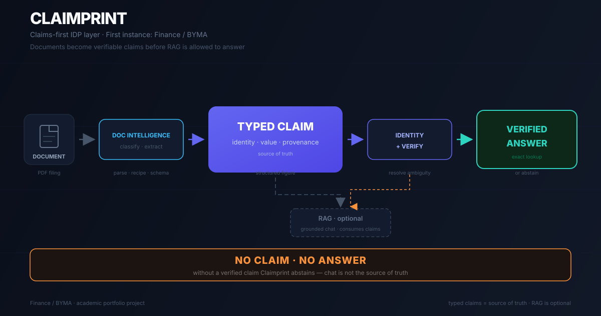
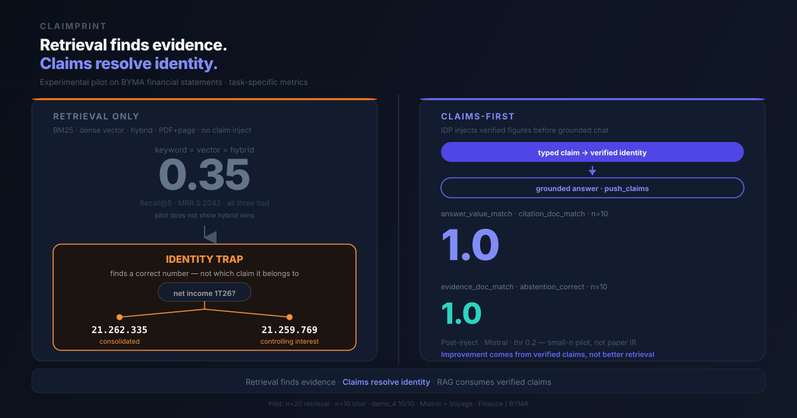

# Claimprint

[](https://github.com/javi2481/claimprint/actions/workflows/ci.yml)

[Español](README.es.md) · **English** ([README.md](README.md))

**IDP claims-first — primera instancia: finanzas (BYMA).**  
**Regla: no claim, no answer** (sin claim verificado, no hay respuesta).

## El problema

En un EEFF trimestral de BYMA, "resultado neto 1T26" tiene dos filas vecinas en el estado de resultados. Un stack RAG puede recuperar la página correcta y aun así responder con la fila equivocada.

| | Valor |
|--|--|
| Pregunta | ¿Cuál es el resultado neto del período 1T26? |
| Vecino incorrecto (controlante) | 21259769 |
| Claimprint (consolidado) | **21262335** |

No es un error de redondeo. Es identidad de fila — atribuir la cifra *controlante* cuando la pregunta pedía *consolidado*. Para un analista, un auditor o un equipo de compliance que automatiza extracción sobre filings, ese desajuste invalida cualquier modelo construido encima de una respuesta que parece correcta.

Claimprint resuelve la **identidad del claim** — clave compuesta `emisor · período · scope · métrica` — antes de generar cualquier respuesta.

Esta arquitectura nació de un fallo concreto: un stack RAG que recuperaba la página correcta de BYMA pero respondía con confianza la fila *controlante* en lugar de la *consolidado*. Claimprint formaliza la solución: resolver identidad como claim tipado antes de generar.

[`scripts/idp_ask.py`](scripts/idp_ask.py) responde la fila consolidada desde fixtures commiteados — sin Docker, sin API keys. Ver la sección **Inicio rápido** más abajo.

## Para quién es

| Rol | Contexto | Qué obtiene |
|-----|----------|-------------|
| Analista de research / equity | Modelos sobre EEFF, comunicados, presentaciones | Cifras con identidad verificada (consolidado vs controlante) |
| Auditor / controller | Revisión de extracción automatizada | Abstención cuando la pregunta no tiene claim |
| Ingeniero IDP / RAG | Pipeline documento → respuesta | Separación clara: claim = fuente de verdad, chunk = derivado para chat |
| Compliance / riesgo | Automatización sobre filings regulados | Provenance (página, fila, filing) en cada respuesta |

## Cómo funciona Claimprint

Claimprint es una **capa IDP claims-first**, no un wrapper de RAG. Un documento entra a Document Intelligence (parse con MinerU, classify, extract) y se convierte en un **claim tipado**: cifra estructurada con **identidad** (`emisor · período · scope · métrica`), **valor** y **provenance** (página, fila, filing). La clave compuesta se resuelve y verifica antes de emitir cualquier respuesta. El camino principal es **lookup exacto** → respuesta verificada. El chat RAG es una capa **opcional** que consume claims verificados; no es la fuente de verdad. Si ningún claim pasa verificación, Claimprint **abstiene** — no claim, no answer.

*Términos técnicos en inglés a propósito (como en el código): claim, recipe, scope, provenance, filing.*



| Artefacto | Rol |
|-----------|-----|
| PDF | evidencia primaria |
| Fixture MinerU | representación parseada |
| Recipe | contrato de extracción |
| Eval gold | expectativa de test |
| Claim | fuente de verdad operativa |
| Chunk RAG | entrada derivada para chat |
| Chat | consumidor |

**Conceptos clave:** un **claim tipado** es la cifra verificada (identidad compuesta + valor + provenance). Una **recipe** es el contrato de extracción para una clase de documento (ej. [`recipes/financial_statement.json`](recipes/financial_statement.json)). Un **projector** mapea filas extraídas al schema — resolviendo **scope** (consolidado vs controlante) en el camino.

Detalle: [`docs/architecture.es.md`](docs/architecture.es.md)

## Qué demuestra el piloto

La trampa **21.262.335 vs 21.259.769** no es anécdota — la corrimos como experimento.

Si retrieval solo — keyword, vector o híbrido — pudiera resolver la trampa de identidad, esta arquitectura no haría falta. Corrimos los tres brazos sobre el mismo corpus (n=20): **empatan** en Recall@5 **0.35** / MRR **0.2042**. Eso no es "el stack falló"; es evidencia de que recuperar PDF+página no alcanza cuando dos filas vecinas comparten contexto semántico.



Con claims inyectados (`push_claims`), el chat claims-first puntúa **1.0** en `answer_value_match`, `citation_doc_match`, `evidence_doc_match` y `abstention_correct` sobre n=10 casos task-specific. El salto no es "mejor retrieval" — es identidad resuelta antes de generar.

Son resultados congelados de un piloto manual en stack RAGFlow local (n=20 / n=10 — piloto chico, no benchmark IR general). CI (`./scripts/check.sh` + pytest) valida contratos y lógica de scoring; no reproduce estos scores. La ablación Gate 4 en [`docs/evaluation.es.md`](docs/evaluation.es.md) muestra cómo se mueven los scores según modo de inject.

## Qué trae el clone

| Listo al clonar (sin Docker) | Opcional (lo construís local) |
|------------------------------|-------------------------------|
| PDFs BYMA + fixtures MinerU en [`fixtures/mineru/`](fixtures/mineru/) | Stack RAGFlow vía [`scripts/up.sh`](scripts/up.sh) |
| [`scripts/idp_ask.py`](scripts/idp_ask.py) — EEFF, comunicado, presentación | Dataset **`demo_4`** indexado en la UI (no viene en git) |
| Recipes, [`evals/`](evals/), pytest, [`scripts/check.sh`](scripts/check.sh) | Piloto de chat + métricas congeladas en [`docs/evaluation.es.md`](docs/evaluation.es.md) |
| HITL [`scripts/review_pack.py`](scripts/review_pack.py), dossier [`scripts/informe.py`](scripts/informe.py) | API keys en `.env` (Mistral + Voyage; gitignored) |

Si querés el piloto de chat, calculá **x86_64**, **≥16 GB RAM** y tiempo para parsear e indexar `demo_4` vos mismo.

## Inicio rápido

```bash
git clone https://github.com/javi2481/claimprint.git
cd claimprint
uv venv && uv pip install -r requirements-dev.txt  # requiere uv (https://astral.sh/uv) — o: python -m venv .venv && pip install -r requirements-dev.txt
./scripts/check.sh
python scripts/idp_ask.py "¿Cuál es el resultado neto del período 1T26?"
# → 21262335
python scripts/idp_ask.py "¿Cuál es la fecha del comunicado de prensa 1T26?"
# → 2026-05-08
python scripts/idp_ask.py "¿Cuál es el EBITDA de la presentación 1T26?"
# → 72128
python scripts/idp_ask.py "¿Cuál es el margen EBITDA LTM del comunicado de prensa 1T26?"
# → 76
python scripts/review_pack.py   # outputs/review/index.html (HITL)
python scripts/informe.py       # outputs/dossier.html
```

En Windows, ejecutá `./scripts/check.sh` desde Git Bash o WSL.

## Flujo en terminal

Dos caminos por `idp_ask`: responder cuando existe un claim verificado, abstener cuando la pregunta está fuera de corpus o no está soportada.

**Camino respuesta**

```
Pregunta: ¿Cuál es el resultado neto del período 1T26?
   ↓
Intent de identidad (consolidado | resultado_neto | 2026-03-31)
   ↓
Claims candidatos (fixtures → extract → store)
   ↓
Claim verificado  BYMA|2026-03-31|consolidado|resultado_neto = 21262335
   ↓
Respuesta         21262335  (página 4, RESULTADO NETO DEL PERÍODO)
```

**Camino abstención**

```
Pregunta: ¿Cuál fue el precio de cierre de YPF en BYMA el 3 de enero?
   ↓
Ambiguo / no soportado (off_corpus — no hay precio YPF en corpus)
   ↓
ABSTAIN           route: abstain · claims: []
```

La extracción sigue la misma regla: si el emisor no se puede determinar desde texto o filename, el documento se omite en lugar de asumir BYMA por defecto.

## Alcance

| Incluido | Excluido |
|----------|----------|
| Primera instancia: PDFs BYMA en [`docs/archivos_muestra/`](docs/archivos_muestra/) | Volúmenes Docker |
| Texto parseado en [`fixtures/mineru/`](fixtures/mineru/) | Índices vectoriales pre-armados o datasets externos grandes |
| Recipes, `evals/`, pytest | API keys (Mistral, Voyage, …) |
| `scripts/idp_ask.py`, HITL, dossier | Chunks RAG o chat pre-armados |

## UI opcional RAGFlow

No es necesaria para lookup de identidad. Demo de chat grounded sobre el mismo corpus. Requiere Docker Compose, **x86_64**, **≥16 GB RAM** y API keys locales (Mistral + Voyage). El clone **no** incluye un `demo_4` indexado; las métricas del piloto requieren reconstruir el stack localmente.

```bash
cp .env.example .env   # agregar keys; .env no está en git
./scripts/check.sh
./scripts/up.sh        # UI: http://localhost
```

Activar Show Quote, respuesta vacía sin evidencia, umbral de similitud **0.2**, luego `python scripts/push_claims.py` y un chat **nuevo**. Ver [`docs/architecture.es.md`](docs/architecture.es.md) para ciclo de inject y [`docs/evaluation.es.md`](docs/evaluation.es.md) para números del piloto.

```bash
docker compose --env-file .env \
  -f vendor/ragflow-docker/docker-compose.yml \
  -f docker-compose.overlay.yml down -v
```

## Documentación

| Doc | Contenido |
|-----|-----------|
| [`docs/architecture.es.md`](docs/architecture.es.md) | Identidad, provenance, contrato de claim, inject; "kernel" como término técnico |
| [`docs/evaluation.es.md`](docs/evaluation.es.md) | Gate 3, ablación Gate 4, scoring |
| [`docs/archivos_muestra/README.es.md`](docs/archivos_muestra/README.es.md) | PDFs de muestra BYMA |

## Qué demuestra esto, qué sigue

Claimprint muestra que el document AI sobre filings financieros falla en **identidad**, no en profundidad de retrieval ni calidad de embeddings — la misma trampa **21.262.335 vs 21.259.769** con la que empezó el proyecto. La instancia BYMA está congelada y es reproducible: recipes, evals, abstención, UI RAGFlow opcional. No es un benchmark IR general, y todavía no es una segunda vertical.

Próximo: endurecer provenance (source a nivel bbox), afinar reglas de inject en chat (deck vs EEFF), y validar el patrón recipe/projector en otra clase de documento antes de generalizar más allá de finanzas.

## Licencia

Claimprint (código propio de este repositorio) es **Apache-2.0**; ver [`LICENSE`](LICENSE). El `docker/` vendoreado de RAGFlow se redistribuye sin modificar bajo Apache-2.0. Citar como [`CITATION.cff`](CITATION.cff).
