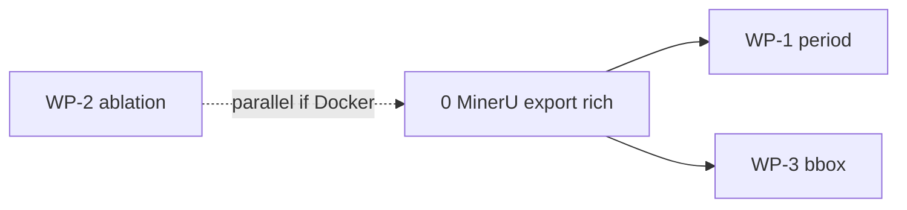

# Design: claimprint-v1.1-three-wp

## Principle

MinerU already runs in production. Claimprint currently keeps **text + page markers**
and throws away bbox, block types, and structured tables. WP-3 fixes that export gap;
WP-1 consumes the same artifacts for period; WP-2 is independent (RAG layer).

## Gate discipline

| Gate | What freezes | When |
|------|----------------|------|
| Gate 3 (v1.0.0) | Recall@5 0.35, MRR 0.2042, chat 1.0/10 | Already shipped — do not edit |
| Gate 4 (WP-2) | Ablation table A/B/C | New `outputs/rag_ablation.json` + README § |
| Gate 5 (WP-1) | press_v1 + presentation_v1 green with content-first | `check.sh` only |
| Gate 6 (WP-3) | EEFF neto 1T26 claim has verifiable bbox or honest null | HITL spot-check |

## ADR: MinerU artifacts on disk

```
fixtures/mineru/
  BYMA_....md              # text (existing)
  BYMA_....content.json    # content_list from MinerU or RAGFlow positions rollup
```

- Source priority: MinerU `content_list` via `mineru-api` when Docker up;
  else derive span list from RAGFlow chunk `positions` + `content` (offline from demo_4).
- Kernel tests MUST NOT require Docker; committed JSON sidecars are the CI path.

## ADR: content-first period

Order in `_period_from_text_and_name`:

1. ISO date regex on front matter / page 1 blocks (`content_list` type title/text)
2. Quarter tokens in body (`1t26`, `2t26`) with disambiguation when both appear
3. Filename tokens (`1t26` in name) — fallback only

## ADR: ablation arms

| Arm | Chunks inject | IDP_RULES prompt |
|-----|---------------|------------------|
| A | off | off |
| B | on | off |
| C | on | on (current) |

Use separate assistant names (`chat_demo_4_a` …) or scripted restore between runs.
Always `clear_chat_sessions.py` after live eval.

## ADR: bbox on Claim

- `document_id`: sha256 of source PDF under `docs/archivos_muestra/`
- `source_bbox`: `[x0,y0,x1,y1]` normalized 0–1 from MinerU 0–1000 scale + `page_size`
- Match: find `content_list` block whose text contains `source_text` or value digits
- No match → `source_bbox=None` (never guess)

## Sequence (recommended)



WP-2 can run in parallel once inject flags exist; it does not need bbox.
